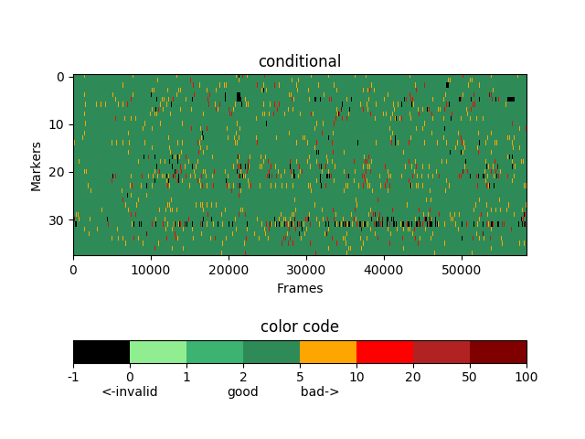

# C3D-Statistics
Analyze conditional values of C3D data generated by Phasespace Impulse X2 motion capture system

Example plot:

Results are also exported as CSV tables.

The c3d module can only read Intel C3D format. You could use [Mokka](https://biomechanical-toolkit.github.io/mokka/index.html) to convert Vicon C3D to Intel C3D.
